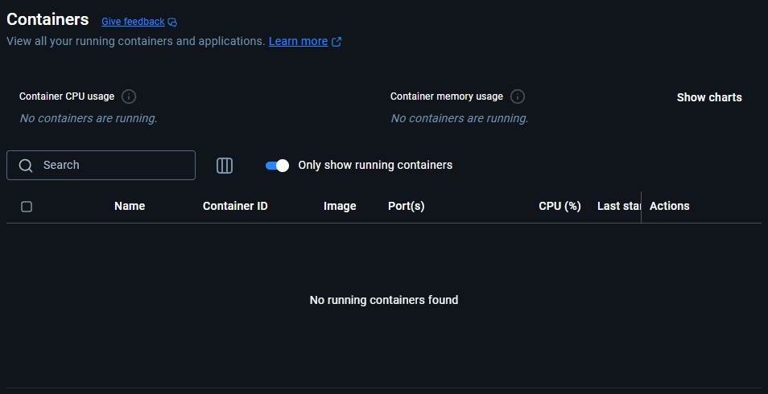
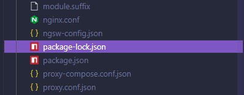
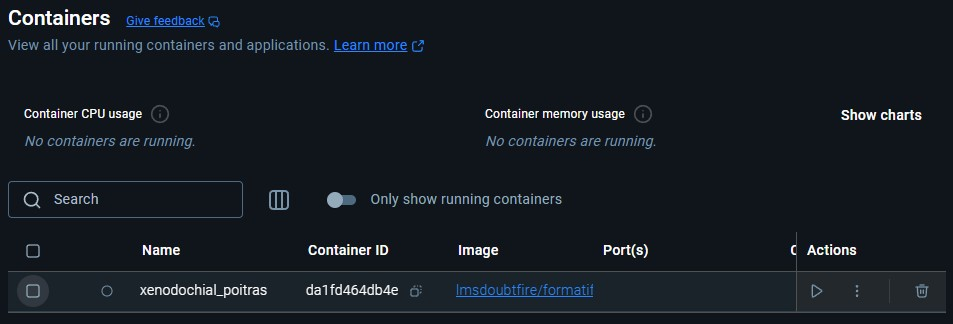
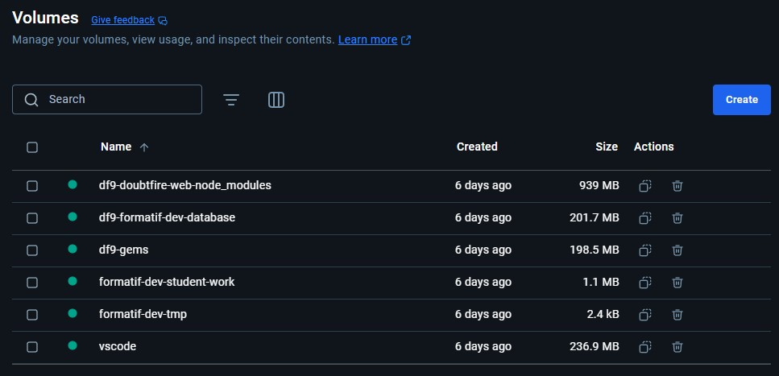
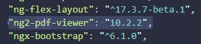
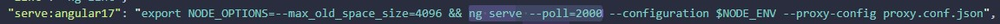
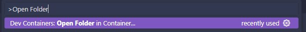

> **Note:** This guide addresses a known issue affecting Windows users when setting up the development environment for the 8.0.x and 9.x branches. macOS users are not impacted and do not require these steps.

# Windows Development Environment Setup

Follow the steps below to ensure a smooth setup process on Windows for the 8.0.x and 9.x branches of Doubtfire. These instructions must be followed each time you switch between these branches.

---

## 1. Switch All Repositories to the Target Branch

Ensure that all three repositories—`doubtfire-deploy`, `doubtfire-web`, and `doubtfire-api`—are checked out to the branch you intend to work on (`8.0.x` or `9.x`).

## 2. Close the Development Container

If you are using Visual Studio Code with Dev Containers, close VS Code to stop the development container.

> You can verify that the container is stopped in Docker Desktop under the **Containers** tab.



## 3. Remove `package-lock.json`

Navigate to your `doubtfire-deploy` directory and delete the following file:

```
doubtfire-deploy/doubtfire-web/package-lock.json
```



## 4. Open Docker Desktop

Launch Docker Desktop if it is not already running.

## 5. Delete Old Containers

In Docker Desktop, go to the **Containers** tab. Delete any containers with the image name pattern `lmsdoubtfire/...`.



## 6. Delete Docker Volumes

In Docker Desktop, navigate to the **Volumes** tab and delete all volumes.



## 7. Update `package.json` (Before Starting the Container)

**Do not start your development container yet.**

Open `doubtfire-deploy/doubtfire-web/package.json` and make the following changes:

- Change the dependency version for `ng2-pdf-viewer` from `^10.2` to `10.2.2`.

  

- Update the `ng serve` script to use polling:

  Change `ng serve` to `ng serve --poll=2000`.

  

## 8. Restart the Development Container

Once the above steps are complete, restart your development container using Dev Containers in VS Code.



---

## Final Notes

Maintaining branch consistency across all three repositories is essential. Repeat these steps each time you switch between the 8.0.x and 9.x branches. Most development should occur on the 9.x branch.
